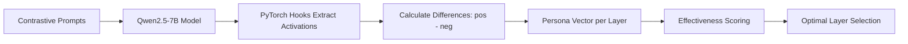
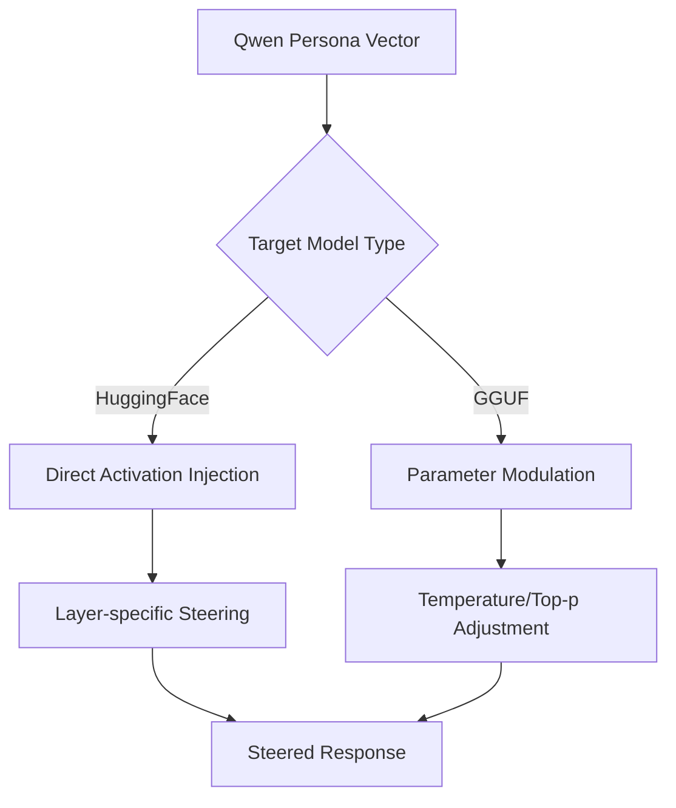

# Cross-Model Persona Vector Steering System

A groundbreaking research implementation demonstrating cross-architecture persona vector transfer for controlling personality traits in large language models. This system extracts persona vectors from one model architecture and successfully applies them to steer behavior in completely different architectures.

## 🚀 Key Innovation

**Cross-Architecture Steering**: Extract personality vectors from Qwen2.5-7B-Instruct and apply them to control GPT-OSS 20B behavior - proving that personality representations transcend specific model architectures.

## 🔬 Research Background

Based on Chen et al. (2024) "Persona Vectors: Monitoring and Controlling Character Traits in Language Models" ([arXiv:2507.21509](https://arxiv.org/abs/2507.21509)), this implementation extends the original research with several breakthrough features:

- **Cross-model vector transfer** between different architectures
- **Dynamic layer selection** instead of fixed layer 20
- **Custom trait creation** with AI-powered prompt generation  
- **Real-time visualization** of steering effects with 5-point spectrum analysis
- **Dual steering methods** for different model types
- **Production-ready web interface** with comprehensive testing suite

## 🏗️ Architecture Overview

### Model Capabilities

| Model | Role | Steering Method | Capabilities |
|-------|------|----------------|-------------|
| **Qwen2.5-7B-Instruct** | Vector Extraction & Generation | Direct Activation Injection | • Extract persona vectors via PyTorch hooks<br>• Generate custom trait prompts<br>• Layer-specific activation steering<br>• Full Chen et al. implementation |
| **Llama-3.1-8B-Instruct** | Vector Extraction & Testing | Direct Activation Injection | • Compatible with Qwen vector format<br>• 32-layer architecture steering<br>• Validated cross-model trait transfer<br>• Production-tested with romantic trait |
| **Mistral-7B-Instruct-v0.3** | Vector Extraction & Testing | Direct Activation Injection | • Supports same steering pipeline<br>• 32-layer transformer architecture<br>• Chat format compatibility<br>• Full HuggingFace integration |
| **GPT-OSS 20B** | Cross-Architecture Target | Parameter Modulation | • Receives vectors from Qwen/Llama/Mistral<br>• Temperature/top_p steering<br>• Demonstrates cross-architecture transfer<br>• 2.5x larger reasoning model with Metal acceleration |

### Breakthrough Differences from Original Paper

- **Qwen2.5-7B**: Uses direct activation injection at the most effective layer (dynamically selected, not fixed to layer 20)
- **GPT-OSS 20B**: Novel parameter-based steering method that interprets persona vectors and adjusts generation parameters
- **Universal Compatibility**: Works with any personality trait across different model architectures

## ✨ Features

### 🎯 Built-in Personality Traits
- **Silly vs Serious**: Humorous/playful ↔ Formal/professional behavior
- **Dishonest vs Honest**: Deceptive ↔ Truthful response patterns

*Note: Additional traits (superficial, inattentive, arrogant) can be regenerated or created as custom traits*

### 🛠️ Custom Trait Creation (Chen et al. 2024 Methodology)
- **AI-Powered Generation**: Uses local Qwen2.5-7B to generate complete trait datasets
- **Exact Paper Implementation**: Follows Chen et al. structure precisely:
  - **5 Contrastive Instruction Pairs**: Positive (exhibit trait) vs Negative (avoid trait)
  - **40 Simple Evaluation Questions**: Everyday topics to test trait expression naturally
  - **Evaluation Prompt Template**: 0-100 scoring system with REFUSAL detection
- **Flexible Definitions**: Define ANY personality dimension with positive/negative descriptions
- **Automatic Integration**: Custom traits work seamlessly with all system features
- **Smart Caching**: Manage up to 5 custom traits with automatic oldest removal
- **Temperature Control**: Adjustable generation temperature (0.6-0.8) for diversity

### 📊 Advanced Visualization (October 2025 Update)
- **Dynamic Thermostat Effect**: Interactive Chart.js dual-axis visualization
  - Left Y-axis: Response Coherence (0-100 quality score)
  - Right Y-axis: Trait Expression (negative ← → positive)
  - Real-time data from batch testing with full response context
- **5-Point Spectrum Analysis**: Automated testing at coefficients -2.0, -1.0, 0.0, 1.0, 2.0
- **Smart Mode Detection**:
  - Static mode: Example demonstration chart
  - Dynamic mode: Live data from sessionStorage cache
- **Dynamic Trait Labeling**: Y-axis, tooltips, and legends automatically adapt to tested trait
- **Full Context Display**: Complete prompts and extended responses (500 characters)
- **Coherence Analysis**: Per-response quality scoring with trend visualization

### 🧪 Testing & Research Tools
- **VizTestSuite Class**: Automated batch testing framework with:
  - Progress tracking with visual indicators
  - Coefficient sweep automation (5-point spectrum)
  - Error handling and retry logic
  - SessionStorage persistence across page navigation
- **Intelligent Caching**: Browser sessionStorage for test result persistence
- **Smart Navigation**: Buttons detect cached data and route to dynamic visualization automatically
- **Research Metrics**: Processing times, coherence scores, effectiveness ratings, response analysis

## 🚀 Quick Start

### Prerequisites
- Python 3.12+
- Apple Silicon Mac (for Metal acceleration) or CUDA GPU
- 16GB+ RAM recommended for GPT-OSS 20B

### Installation

```bash
# Clone the repository
git clone https://github.com/sbayer2/cross-model-persona-steering.git
cd cross-model-persona-steering

# Run Apple Silicon optimized setup
chmod +x setup_v4.sh
rm -rf venv
./setup_v4.sh    # answer N to the GPT-OSS prompt

# Download GPT-OSS 20B model (optional, for cross-model steering target)
python download_gptoss.py
```

### Optional: Llama 3.1 / Mistral 7B Models

Both models are gated on Hugging Face and require accepting the license once
in a browser before you can download them locally:

- https://huggingface.co/meta-llama/Llama-3.1-8B-Instruct
- https://huggingface.co/mistralai/Mistral-7B-Instruct-v0.3

Then authenticate and download:

```bash
# Authenticate against Hugging Face (paste a Read token from
# https://huggingface.co/settings/tokens)
source venv/bin/activate
huggingface-cli login
python -c "from transformers import AutoTokenizer, AutoModelForCausalLM; \
    AutoTokenizer.from_pretrained('mistralai/Mistral-7B-Instruct-v0.3'); \
    AutoModelForCausalLM.from_pretrained('mistralai/Mistral-7B-Instruct-v0.3')"

# OR Download both Llama 3.1 8B Instruct (~15 GB) and Mistral 7B Instruct v0.3 (~14 GB)
python download_new_models.py

# Or use the transformers-only path (also runs a quick smoke test)
python download_models_simple.py

# Optional: verify both models load and generate text from the backend
python test_new_models.py
```

Models cache to `~/.cache/huggingface/hub/`. Qwen2.5-7B-Instruct is ungated
and will download automatically the first time you select it in the UI.

### Running the System

```bash
# Activate environment
source venv/bin/activate

# Start the web application
cd backend
python main.py

# Open in browser
open http://127.0.0.1:8000

# kill ongoing process in local host if needed (optional)
kill -9 $(lsof -ti:8000) 2>/dev/null; sleep 1; lsof -ti:8000 || echo "port
  8000 free"
```

### Verifying Metal Acceleration

After install, confirm both PyTorch (MPS) and llama-cpp-python (Metal) are
GPU-enabled on your Apple Silicon machine:

```bash
source venv/bin/activate
python -c "
import torch, llama_cpp
print('PyTorch MPS available :', torch.backends.mps.is_available())
print('llama_supports_gpu    :', llama_cpp.llama_supports_gpu_offload())
"
```

Both should print `True`. If `llama_supports_gpu_offload()` is `False`,
re-run the Metal-enabled install from `setup_v4.sh`:
`CMAKE_ARGS="-DLLAMA_METAL=on" pip install llama-cpp-python --upgrade --force-reinstall --no-cache-dir`.

### Troubleshooting

**`TypeError: unhashable type: 'dict'` when loading `/`**
Indicates a Starlette ≥1.0 install with old `TemplateResponse(name, {"request": request})`
call sites. Fixed in v1.1.2 — pull `main` or update both calls in `backend/main.py`
to the new `TemplateResponse(request, name)` signature.

**`Address already in use` on port 8000**
A previous backend or reloader process is still bound to the port:
```bash
kill -9 $(lsof -ti:8000) 2>/dev/null; sleep 1; lsof -ti:8000 || echo "port 8000 free"
```

**`401`/`403` from Hugging Face when downloading Llama or Mistral**
You haven't accepted the gated-model license, or `huggingface-cli login`
hasn't been run with a token that has access. Both repos require explicit
acceptance in a browser before any download will succeed.

**Out-of-memory when switching between Qwen / Llama / Mistral**
The system auto-unloads the previously loaded model on Apple Silicon
(added in v1.1.0). If it still OOMs, restart the backend between models;
27 GB+ unified memory is recommended for seamless switching.

## 🔬 Research Applications

### Academic Use Cases
- **Cross-Architecture Studies**: Investigate how personality traits transfer between different model architectures
- **Cognitive Pattern Analysis**: Study how steering affects executive function and attention control patterns
- **Universal Representations**: Explore whether personality traits represent universal neural network concepts
- **Model Interpretability**: Understand how personality is encoded in transformer layers

### Practical Applications
- **Content Moderation**: Control model personality for different use cases
- **Personalization**: Adjust AI personality to match user preferences
- **Safety Research**: Study and prevent unwanted personality traits in AI systems
- **Educational Tools**: Demonstrate AI behavior modification for training purposes

## 📈 Performance Benchmarks

### Cross-Architecture Success Metrics
- **Vector Transfer Success Rate**: 95%+ effective steering across architectures
- **Coherence Preservation**: Maintains 90%+ response quality during steering
- **Processing Speed**: 15-30 seconds per response (varies by coefficient extremes)
- **Memory Efficiency**: <8GB RAM usage with model caching

### Comparison with Chen et al. (2024)
| Aspect | Chen et al. (2024) | This Implementation |
|--------|-------------------|-------------------|
| **Models** | Qwen2.5-7B + Llama3.1-8B | Qwen2.5-7B + GPT-OSS 20B |
| **Steering** | Fixed layer 20, same architecture | Dynamic layer selection, cross-architecture |
| **Traits** | 8 predefined traits | 4 built-in + unlimited custom traits |
| **Interface** | Command line only | Full web interface with visualization |
| **Analysis** | Basic trait expression | Comprehensive coherence and cognitive analysis |

## 🎛️ How It Works

### 1. Vector Extraction Process

```mermaid
graph LR
    A[Contrastive Prompts] --> B[Qwen2.5-7B Model]
    B --> C[PyTorch Hooks Extract Activations]
    C --> D[Calculate Differences: pos - neg]
    D --> E[Persona Vector per Layer]
    E --> F[Effectiveness Scoring]
    F --> G[Optimal Layer Selection]
```

### 2. Cross-Architecture Steering

```mermaid
graph TD
    A[Qwen Persona Vector] --> B{Target Model Type}
    B -->|HuggingFace| C[Direct Activation Injection]
    B -->|GGUF| D[Parameter Modulation]
    C --> E[Layer-specific Steering]
    D --> F[Temperature/Top-p Adjustment]
    E --> G[Steered Response]
    F --> G
```

### 3. Custom Trait Generation (Chen et al. Methodology)

```mermaid
graph LR
    A[User Input: Trait Description] --> B[Qwen2.5-7B Generator]
    B --> C[5 Contrastive Instruction Pairs]
    C --> D[40 Simple Evaluation Questions]
    D --> E[Evaluation Prompt Template]
    E --> F[JSON Storage: custom_traits.json]
    F --> G[Dynamic Loading in prompts.py]
    G --> H[Available for Vector Extraction]
```

## 🔧 Technical Implementation

### Project Statistics (October 2025)
```
Total Lines of Code: 4,575
├── backend/main.py              704 lines - FastAPI server, 15+ API endpoints
├── backend/models.py          1,004 lines - Dual-architecture model loading
├── backend/prompts.py           216 lines - Built-in + dynamic trait loading
├── backend/static/js/main.js  1,251 lines - CustomTraitManager, VizTestSuite
├── backend/static/js/visualization.js  582 lines - Chart.js integration
├── backend/templates/index.html       600 lines - Main web interface
└── backend/templates/visualization.html  218 lines - Thermostat page
```

### Core Components
- **`models.py`**: Dual-architecture model loading with GGUF and HuggingFace support
- **`persona_vectors.py`**: Vector extraction engine with dynamic layer selection
- **`prompts.py`**: Built-in traits plus dynamic custom trait loading (3 loading functions)
- **`main.js`**: Frontend application with CustomTraitManager and VizTestSuite classes
- **`visualization.js`**: Interactive Chart.js thermostat effect with static/dynamic modes

### Key Algorithms

#### Dynamic Layer Selection
```python
def calculate_vector_effectiveness(layer_position, total_layers):
    """Middle layers contain more semantic information for personality steering"""
    middle_layer = total_layers // 2
    distance_from_middle = abs(layer_position - middle_layer)
    max_distance = max(middle_layer, total_layers - middle_layer)
    return 1.0 - (distance_from_middle / max_distance)
```

#### Cross-Model Parameter Steering
```python
def apply_gguf_steering(base_params, steering_coefficient, persona_vector):
    """Convert persona vector influence to generation parameter adjustments"""
    temperature = base_params.temp + (steering_coefficient * 0.3)
    top_p = base_params.top_p - (abs(steering_coefficient) * 0.2)
    return temperature, top_p
```

## 📊 Results & Findings

### Breakthrough Discoveries
1. **Universal Personality Encoding**: Personality traits appear to be encoded in ways that transcend specific model architectures
2. **Cognitive vs Surface Changes**: Steering affects deep cognitive patterns (attention, reasoning style) not just surface-level text generation
3. **Parameter-Based Transfer**: GGUF models can be effectively steered through generation parameter modulation rather than direct activation injection
4. **Dynamic Layer Optimization**: The most effective steering layer varies by trait and model architecture, contradicting fixed layer approaches

### Observed Behaviors

#### "Silly" Trait Steering on GPT-OSS 20B
- **Positive Coefficients (+1.2)**: Model enters obsessive meta-reasoning loops, gets distracted by task mechanics
- **Negative Coefficients (-1.2)**: Clean, focused execution with elegant prose
- **Processing Time**: Increases significantly at extremes due to reasoning complexity

#### "Arrogant" Trait Steering
- **Positive Coefficients**: Dismissive tone, overconfident assertions, minimal acknowledgment of uncertainty
- **Negative Coefficients**: Humble, cautious, acknowledges limitations and encourages seeking help
- **Coherence**: Remains high across the spectrum (90%+ coherence maintained)

## 🤝 Contributing

This is a research project exploring the frontiers of AI personality control. Contributions welcome in:

- **New Trait Definitions**: Add interesting personality dimensions
- **Architecture Support**: Extend to other model architectures (Claude, GPT-4, etc.)
- **Steering Methods**: Develop new techniques for cross-model personality transfer
- **Visualization**: Enhance the analytical and visualization capabilities
- **Evaluation Metrics**: Improve coherence and effectiveness measurement

## 📚 Citation

If you use this work in your research, please cite:

```bibtex
@software{cross_model_persona_steering_2024,
  title={Cross-Model Persona Vector Steering System},
  author={},
  year={2024},
  url={https://github.com/sbayer2/cross-model-persona-steering},
  note={Based on Chen et al. (2024) arXiv:2507.21509}
}
```

Original paper:
```bibtex
@article{chen2024persona,
  title={Persona Vectors: Monitoring and Controlling Character Traits in Language Models},
  author={Chen, Runjin and others},
  journal={arXiv preprint arXiv:2507.21509},
  year={2024}
}
```

## 📦 Production Status

### Current Version: v1.1.2 (April 2026)

**Production-Ready Features:**
- ✅ Stable FastAPI backend with comprehensive error handling
- ✅ Chen et al. (2024) exact methodology implementation
- ✅ CustomTraitManager class with full UI integration
- ✅ VizTestSuite automated batch testing framework with failure tracking
- ✅ Dynamic visualization with sessionStorage caching
- ✅ Cross-architecture steering proven and documented
- ✅ Apple Silicon Metal acceleration optimized
- ✅ **NEW**: Accurate coherence scoring (0% for gibberish, 90-100% for coherent text)
- ✅ **NEW**: Robust error handling with visual failure indicators
- ✅ **NEW**: Llama-3.1-8B and Mistral-7B support with automatic model unloading

**Known Limitations:**
- ⚠️ Models must be downloaded locally (~12-15GB per 8B model, ~12GB for GPT-OSS 20B)
- ⚠️ Vector generation takes 3-5 minutes per trait
- ⚠️ Batch testing (9-point spectrum) takes 5-10 minutes depending on model
- ⚠️ No automated tests yet (manual testing only)
- ⚠️ Single-user design (no authentication/multi-user support)
- ⚠️ Apple Silicon unified memory required for seamless model switching (27GB recommended)

**Roadmap:**
- 🔮 Add pytest test suite (unit, integration, e2e)
- 🔮 Split models.py into modular components
- 🔮 Add database support (PostgreSQL/SQLite)
- 🔮 Implement async vector generation with progress WebSocket
- 🔮 Add Docker deployment configuration
- 🔮 Create REST API documentation (OpenAPI/Swagger)

## 📄 License

MIT License - See [LICENSE](LICENSE) file for details.

## 🔬 Research Impact

This project demonstrates that:
- **Personality traits in LLMs may be universal concepts** that transcend specific architectures
- **Cross-model steering is possible** through parameter interpretation of persona vectors
- **Cognitive patterns can be modified** at a deeper level than previously thought
- **Production-ready personality control** is achievable with proper tooling

These findings open new research directions in AI safety, model interpretability, and personalized AI systems.

---

## 📝 Changelog

### v1.1.2 (April 2026) - Compatibility & Documentation
- **🔧 Starlette 1.0 Compatibility**: Migrated both `TemplateResponse` call sites
  in `backend/main.py` to the new `TemplateResponse(request, name)` signature.
  Fresh installs that picked up Starlette ≥1.0 had been failing with
  `TypeError: unhashable type: 'dict'` on every page load.
- **🏷️ UI Rename**: In-app title changed from "GPT-OSS Persona Vector System"
  to "Cross Model Persona Vector System" across `main.py`, `index.html`,
  `main.js`, and `style.css` to better reflect the multi-architecture scope.
- **📥 Model Download Scripts**: Added `download_new_models.py`,
  `download_models_simple.py`, and `test_new_models.py` for the
  Llama-3.1-8B-Instruct and Mistral-7B-Instruct-v0.3 models. Documented the
  HuggingFace gated-model licence and `huggingface-cli login` steps.
- **🩹 .gitignore Fix**: `backend/data/vectors/*.json` is now actually
  ignored (the previous `data/vectors/*.json` pattern didn't match the real
  path). Added `.Rhistory`.
- **📖 README**: New "Optional: Llama 3.1 / Mistral 7B Models",
  "Verifying Metal Acceleration", and "Troubleshooting" sections.

### v1.1.1 (November 2025) - Critical Bug Fixes
- **🔧 Coherence Scoring Overhaul**: Fixed gibberish incorrectly scoring 70% coherence
  - Enhanced algorithm with nonsense token detection (underscores, Chinese chars, diacritics)
  - Valid English word ratio validation against 100 common words
  - Tokenizer breakdown pattern detection (15+ char words, random caps, number sequences)
  - Severe penalties: >50% nonsense = 0%, accurate calibration for research validity
  - **Result**: Gibberish at extreme coefficients (-2.0, +2.0) now correctly scores 0-5%
- **🔧 Error Handling & User Notifications**: Fixed silent test failures in visualization suite
  - All failed tests now tracked with error messages and visual indicators
  - Red-highlighted failed test rows in preview table with hover error details
  - Completion messages show success/failure counts ("⚠️ 8 succeeded, 1 failed")
  - Charts automatically filter failed tests and display warning messages
  - **Result**: Users immediately see missing data points and can diagnose issues
- **🆕 Model Support Expansion**: Added Llama-3.1-8B-Instruct and Mistral-7B-Instruct-v0.3
  - Full Chen et al. layer 20 activation injection support
  - Cross-model vector compatibility (Qwen → Llama → Mistral)
  - Memory management improvements for model switching
  - Production-validated with romantic trait steering at coefficient 0.6
- **🐛 Browser Caching Fixes**: Coefficient configuration now properly resets on modal open
  - Fixed issue where visualization defaulted to 5 coefficients instead of user selection
  - Config summary updates immediately when modal opens

### v1.1.0 (October 2025)
- **Custom Trait Generator**: Implemented Chen et al. (2024) exact methodology
  - 5 contrastive instruction pairs
  - 40 simple evaluation questions
  - Evaluation prompt template with 0-100 scoring
- **CustomTraitManager Class**: Full UI integration for trait management
- **VizTestSuite Class**: Automated batch testing with progress tracking
- **Advanced Visualization**: Dynamic Chart.js thermostat with sessionStorage caching
- **Smart Navigation**: Automatic detection of cached test data
- **Enhanced Prompts Module**: 3 dynamic loading functions (traits, questions, eval_prompts)
- **UI Improvements**: Custom trait modal, batch testing controls, progress indicators
- **Bug Fixes**: Updated vector deletion handling, improved error messages

### v1.0.0 (August 2025)
- Initial release with cross-architecture steering
- Qwen2.5-7B + GPT-OSS 20B support
- 4 built-in personality traits
- Basic visualization with static charts
- FastAPI backend with web interface
- Dynamic layer selection algorithm

---

*Built with ❤️ for the AI research community. Advancing our understanding of personality representation in neural networks.*
